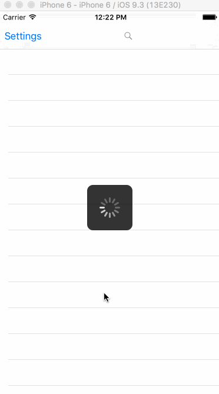

# Project 1 - GithubDemo

GithubDemo is a exercise we will build an app that allows you to search for popular GitHub repositories by language to practice using Auto Layout with table views, handling form input, and passing data back from a view controller.

Time spent:  hours spent in total
Pair programming with Thien Nguyen

From the Starter Project: https://github.com/codepath/ios_github_demo/archive/master.zip

## User Stories

The following **required** functionality is completed:

- [x] User can view a list of repos. Poster images load asynchronously.
- [x] The repository name and description labels should wrap if the text does not fit on one line:
		You can make a label multiline by setting the lines count to 0 in the inspector.
		To get the text to wrap properly for multiline labels with dynamic content you'll need to set the preferredMaxLayoutWidth. Fortunately, for apps targeting iOS8+, there is a simple setting in Interface Builder on the Label to do this automatically for you. Make sure that Preferred Width is set to AutomaticUser can view movie details by tapping on a cell.
- [x] User can do filterring by Number of Stars 
- [x] User can do filterring by language that is controlled by a toggle switch.

The following **optional** features are implemented:

- [ ] Add options for whether the search should match text in a repo's name, description, and/or README. : In-progress
- [ ] Add options for sorting search results based on stars, forks, or relevance (https://developer.github.com/v3/search/#search-repositories).
- [ ] Add options for searching only repositories created after a certain date (e.g. within the past week, month, year).
- [ ] All languages available on github are defined here (https://github.com/github/linguist/blob/master/lib/linguist/languages.yml). Design and implement an interface for filtering based on that list of languages.

The following **additional** features are implemented:

- [ ] List anything else that you can get done to improve the app functionality!

## Video Walkthrough

Here's a walkthrough of implemented user stories:

GIF created with [LiceCap](http://www.cockos.com/licecap/).

## Notes

Describe any challenges encountered while building the app.

## License

    Copyright 2016 Nhung Huynh

    Licensed under the Apache License, Version 2.0 (the "License");
    you may not use this file except in compliance with the License.
    You may obtain a copy of the License at

        http://www.apache.org/licenses/LICENSE-2.0

    Unless required by applicable law or agreed to in writing, software
    distributed under the License is distributed on an "AS IS" BASIS,
    WITHOUT WARRANTIES OR CONDITIONS OF ANY KIND, either express or implied.
    See the License for the specific language governing permissions and
    limitations under the License.
